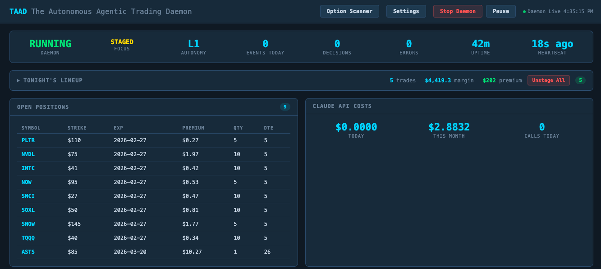
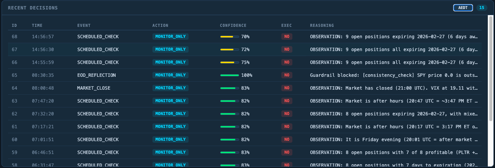
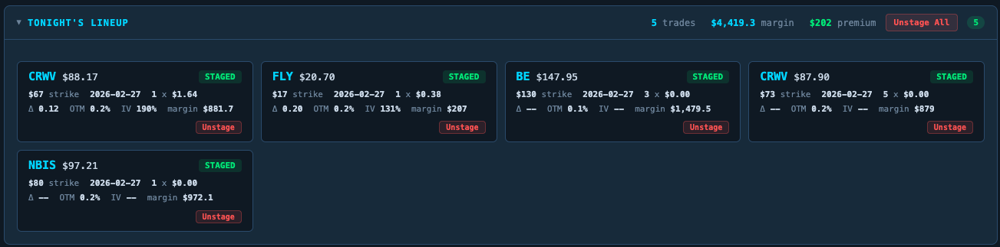
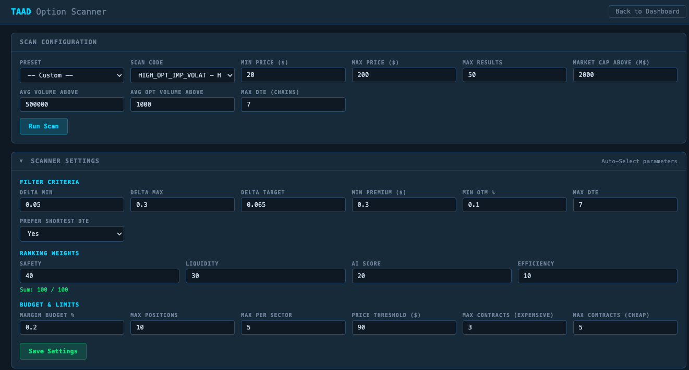
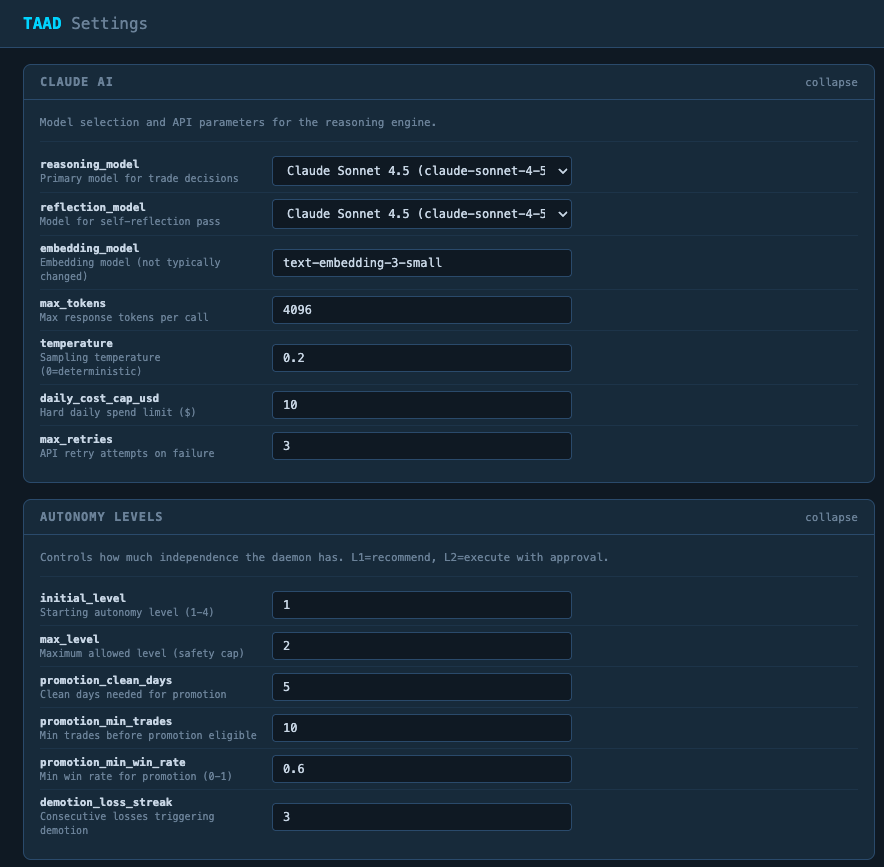

# TAAD - The Autonomous Agentic Trading Daemon

[](https://www.python.org/downloads/)
[](LICENSE)
[]()
[]()
[](https://claude.ai/claude-code)

An AI trading system that sells put options, watches the market, and gets smarter over time. It uses Claude AI to reason about what to do, Interactive Brokers to place trades, and a learning engine that studies every past trade to find what works.

> **Status: Under very active development.** This project is being built and iterated on daily. APIs, database schemas, and behavior may change without notice. Use at your own risk.

> **Disclaimer:** This software is for educational and research purposes. Trading options involves substantial risk of loss. The authors are not responsible for any financial losses incurred through the use of this software. Always paper trade first.

<p align="center">
  
</p>

---

## What It Does

TAAD runs as a background process (daemon) during market hours and does the following:

1. **Scans** for options to sell — finds put options that match your risk criteria (how far out-of-the-money, how much premium, how many days until expiration)
2. **Shows you what it found** — stages candidates on a dashboard for you to review, or executes them automatically if you've given it permission
3. **Checks in every 15 minutes** — asks Claude AI to look at your open positions, market conditions, and decide if anything needs attention
4. **Manages your trades** — places orders through Interactive Brokers with automatic profit targets and stop losses
5. **Learns from results** — after each trade closes, it records what happened and looks for patterns (e.g., "trades opened when VIX is below 15 win more often")
6. **Improves itself** — runs A/B experiments to test new ideas and only adopts changes that are statistically proven to work

The default strategy is selling short-dated (0-7 day) put options on stock indices (SPX, XSP, SPY) and quality stocks.

## How It Works

```
                    +-----------------+
                    |  Event Bus      |  MARKET_OPEN, SCHEDULED_CHECK,
                    |  (time-based)   |  MARKET_CLOSE, EOD_REFLECTION
                    +--------+--------+
                             |
                    +--------v--------+
                    |  Working Memory |  What positions are open? What
                    |  (state store)  |  happened recently? What's the
                    +--------+--------+  market doing?
                             |
              +--------------+--------------+
              |              |              |
     +--------v---+  +------v------+  +----v--------+
     | Guardrails |  | Claude AI   |  | Autonomy    |
     | Safety     |  | "What       |  | Governor    |
     | checks     |  |  should     |  | "Am I       |
     | before &   |  |  we do?"    |  |  allowed    |
     | after AI   |  |             |  |  to do it?" |
     +--------+---+  +------+------+  +----+--------+
              |              |              |
              +--------------+--------------+
                             |
                    +--------v--------+
                    | Action Executor |  Do nothing, place a trade,
                    |                 |  close a position, adjust stops
                    +--------+--------+
                             |
                    +--------v--------+
                    | Interactive     |  Sends orders, gets quotes,
                    | Brokers (IBKR)  |  checks positions
                    +-----------------+
```

Every 15 minutes during market hours, this pipeline runs. Claude sees your positions, P&L, market conditions, and staged candidates — then decides what action to take. Safety guardrails check Claude's reasoning before and after, and the autonomy governor controls what it's actually allowed to execute.

### Key Components

| Component | What it does |
|-----------|-------------|
| **Daemon** | The main loop — wakes up on events and runs the pipeline above |
| **Reasoning Engine** | Sends context to Claude and parses the response into an action |
| **Working Memory** | Keeps track of everything between check-ins (positions, recent decisions, anomalies) |
| **Guardrails** | Safety checks — validates context before Claude sees it, validates Claude's output, blocks suspicious actions |
| **Learning Loop** | Analyzes closed trades for patterns, runs experiments, suggests parameter changes |
| **Scanner** | Finds options that match your criteria using IBKR's market scanner |
| **Dashboard** | Web UI showing what the AI is thinking and doing |

### Autonomy Levels

You control how much independence the system has:

| Level | What it can do |
|-------|---------------|
| L1 | Watch only — every action needs your approval |
| L2 | Can close losing positions and adjust stop losses on its own |
| L3 | Can execute trades you've already reviewed and approved (staged) |
| L4 | Full autonomy within risk limits (use with caution) |

### How It Learns

The system imports your trade history from Interactive Brokers and enriches each trade with context — what was VIX doing when you entered? What were the technicals? Then the learning engine looks for statistically significant patterns across hundreds of trades.

When it finds something promising (e.g., "selling puts on Fridays has a 12% higher win rate"), it doesn't just adopt it. It runs an A/B experiment — applying the new rule to a portion of trades while keeping the baseline for the rest. Only after enough data proves the improvement is real (with statistical significance) does it update the strategy.

## Screenshots

<details>
<summary><strong>AI Decision Log</strong> — Every 15 minutes, Claude looks at everything and makes a call</summary>
<br>

</details>

<details>
<summary><strong>Staged Candidates</strong> — Trades the scanner found, waiting for your approval or auto-execution</summary>
<br>

</details>

<details>
<summary><strong>Option Scanner</strong> — Find options to sell, with filters for risk level, premium, and budget</summary>
<br>

</details>

<details>
<summary><strong>Settings</strong> — Choose your AI model, set autonomy level, and configure risk limits</summary>
<br>

</details>

## Prerequisites

- **Python 3.11+**
- **PostgreSQL 14+** (recommended) or SQLite (for quick testing only)
- **Interactive Brokers** account with TWS or IB Gateway
  - Paper trading account recommended (free, unlimited virtual money)
  - API connections enabled (in TWS: Edit > Global Configuration > API > Settings)
- **Anthropic API key** for Claude AI ([console.anthropic.com](https://console.anthropic.com) — costs ~$0.25/day with Sonnet)

## Installation

```bash
# Clone the repository
git clone https://github.com/axels2025/TAAD.git
cd TAAD

# Create and activate virtual environment
python3.11 -m venv venv
source venv/bin/activate  # Linux/macOS
# venv\Scripts\activate   # Windows

# Install dependencies
pip install -r requirements.txt

# Install the nakedtrader CLI command
pip install -e .
```

This gives you the `nakedtrader` command you'll use for everything.

### Database Setup

**PostgreSQL (recommended):**

```bash
# Create the database
createdb trading_agent

# Initialize tables and run migrations
python scripts/setup_database.py
alembic upgrade head
```

PostgreSQL is recommended because the system uses it for concurrent access (daemon + dashboard + CLI all running at once), separate schemas for trade history analysis, and vector search to find similar past decisions.

**SQLite (quick start / testing only):**

```bash
# Just set this in your .env and it'll use a local file instead
DATABASE_URL=sqlite:///data/databases/trades.db

python scripts/setup_database.py
alembic upgrade head
```

SQLite works for trying things out but doesn't support some features (vector search, concurrent connections, separate schemas).

### Environment Variables

Copy the template and fill in your details:

```bash
cp .env.example .env
```

Key settings in `.env`:

```bash
# IBKR Connection
IBKR_HOST=127.0.0.1
IBKR_PORT=7497              # 7497 = paper trading, 7496 = live
IBKR_CLIENT_ID=1
IBKR_ACCOUNT=DU123456       # Your paper trading account ID

# Anthropic API
ANTHROPIC_API_KEY=sk-ant-your-key-here

# Database (PostgreSQL recommended)
DATABASE_URL=postgresql://localhost/trading_agent
# DATABASE_URL=sqlite:///data/databases/trades.db  # SQLite alternative

# Safety
PAPER_TRADING=true
LOG_LEVEL=INFO
```

See `.env.example` for the full list of options including risk limits, position sizing, and market data settings.

## Usage

### Start the Daemon

```bash
# Start the trading daemon (also starts the web dashboard)
nakedtrader daemon start

# Check if it's running
nakedtrader daemon status

# Stop it
nakedtrader daemon stop
```

Once started, the daemon will:
- Emit a `MARKET_OPEN` event when markets open
- Check in with Claude every 15 minutes during market hours
- Run end-of-day sync and reconciliation at market close
- Idle overnight and on weekends

### Manual Trading Commands

```bash
# Scan for options to sell
nakedtrader scanner run

# Sell a naked put (dry run — shows what it would do)
nakedtrader nakedtrader sell XSP --dry-run

# Sell a naked put (actually places the order in paper trading)
nakedtrader nakedtrader sell XSP --live --yes

# Watch your open positions
nakedtrader nakedtrader sell-watch

# View trade history
nakedtrader nakedtrader sell-status

# Ask Claude to analyze your performance
nakedtrader analyze --ai
```

### Dashboard

The web dashboard starts automatically with the daemon at `http://localhost:5100`. It shows:

- What the AI decided and why (full reasoning for every check-in)
- Your open positions with live P&L
- Staged candidates waiting for approval
- System health and event history

## Development

### Running Tests

```bash
# All tests
pytest

# Unit tests only
pytest tests/unit

# With coverage report
pytest --cov=src --cov-report=html

# A specific test file
pytest tests/unit/test_pattern_detector.py -v
```

### Code Quality

```bash
# Format code
black src/ tests/

# Lint
ruff check src/ tests/

# Type check
mypy src/
```

### Project Structure

```
TAAD/
├── src/
│   ├── agentic/          # The brain — daemon, AI reasoning, memory, guardrails
│   ├── cli/              # Command-line interface
│   ├── config/           # Settings and configuration
│   ├── data/             # Database models and migrations
│   ├── execution/        # Order placement and position management
│   ├── learning/         # Pattern detection, A/B experiments, optimization
│   ├── nakedtrader/      # Daily put-selling workflow
│   ├── services/         # Market data, scanners, reconciliation
│   ├── strategies/       # Trading strategy definitions
│   ├── tools/            # IBKR client wrapper, screener, options finder
│   └── web/              # Dashboard web UI
├── tests/
│   ├── unit/             # ~1800+ unit tests
│   ├── integration/      # Tests that talk to IBKR and the database
│   └── e2e/              # Full workflow tests
├── config/               # YAML configuration files
├── scripts/              # Database setup and utility scripts
└── docs/                 # Documentation, architecture, screenshots
```

## Tech Stack

| Category | Technology |
|----------|-----------|
| Language | Python 3.11+ |
| Broker | ib_insync (Interactive Brokers API) |
| AI | Anthropic Claude (Sonnet by default) |
| Database | PostgreSQL 14+ (recommended) / SQLite (testing) |
| ORM | SQLAlchemy 2.0 + Alembic for migrations |
| CLI | Typer + Rich (for nice terminal output) |
| Dashboard | Flask |
| Statistics | scikit-learn, scipy (for pattern detection and A/B tests) |
| Testing | pytest (1800+ tests) |
| Code Quality | Black, Ruff, MyPy |

## Configuration

The system is configured via two YAML files:

- **`config/phase5.yaml`** — Daemon behavior: autonomy level, which Claude model to use, how often to check in, cost caps
- **`config/daily_spx_options.yaml`** — Strategy parameters: what delta to target, minimum premium, max days to expiration, position sizing

Key settings you'll want to adjust:

| Setting | What it controls | Default |
|---------|-----------------|---------|
| Autonomy level | How much the AI can do without asking you | L1 (watch only) |
| Claude model | Which AI model to use (Sonnet = cheap, Opus = smart) | Sonnet |
| Margin budget | What % of your margin the scanner can use | 20% |
| Max positions | Maximum number of open trades | 10 |
| Daily cost cap | Maximum daily spend on Claude API calls | $10 |

## Contributing

This project is under very active development. If you're interested in contributing:

1. Fork the repository
2. Create a feature branch (`git checkout -b feature/your-feature`)
3. Write tests for your changes
4. Make sure all tests pass (`pytest`)
5. Run code quality checks (`black`, `ruff`, `mypy`)
6. Submit a pull request

## License

This project is licensed under the MIT License — see the [LICENSE](LICENSE) file for details.

## Acknowledgments

- Built with [Claude Code](https://claude.ai/claude-code) by Anthropic
- Uses [ib_insync](https://github.com/erdewit/ib_insync) for Interactive Brokers integration
- Market data provided by Interactive Brokers
